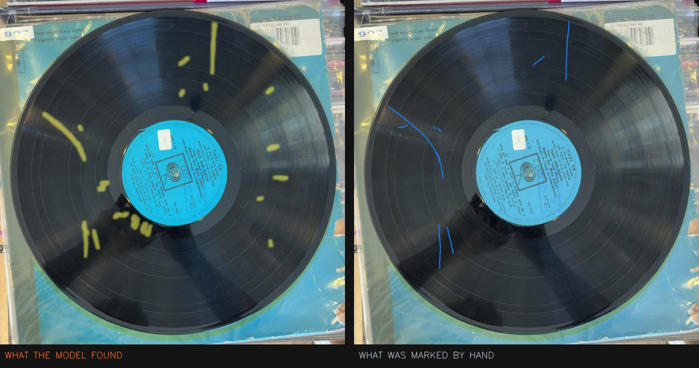

# Off The Record — Quality Scanner

Finds and grades the physical damage on a vinyl record from a phone photograph.
Classical computer vision, no machine learning and no trained model: every
decision it makes can be read as a sentence and argued with.

Built as the condition-assessment engine for **Off The Record**, a marketplace
for second-hand vinyl.



*Left: what the scanner found. Right: the same record with the scratches marked
by hand. Eight marked scratches, eight found, no false detections.*

---

## Results

53 records and 198 photographs, split **by record** so that no record could
appear on both sides of the fence. Every parameter was chosen on the calibration
set and confirmed on validation. The test set was opened once, at the end, after
everything was frozen.

| | records | recall | recall incl. dirt | precision |
|---|---|---|---|---|
| calibration | 30 | 57.2% | 77.2% | 88.4% |
| validation | 11 | 58.9% | 79.5% | 89.8% |
| **test** | **12** | **52.3%** | **80.8%** | **85.2%** |

**Recall** is scored against 1,339 scratches drawn on the records by hand, so it
needs no interpretation. **Precision** counts dirt as a correct call — a dirty
record genuinely is in worse condition — and was measured by classifying all
2,757 detections one at a time by hand.

The three sets agree. A set the model had never seen behaves like the sets it
was tuned on, which is the evidence that nothing was overfitted.

---

## The idea it rests on

A record is thousands of circular grooves. A scratch crosses them.

Re-sample the disc by angle and distance and the grooves become straight
horizontal lines, while the damage stands up against them. A hard problem
becomes a simple one: find a thin bright line in a striped image.

Everything else — two detection channels, adaptive thresholds, shape filters,
the rejection rules — happens in that unwrapped view.

---

## The hard part

Vinyl is a mirror. Tilt it toward a lamp and a bright streak appears: thin,
sharp, and running across the grooves. It is the single largest source of false
detections, and no threshold separates it from real damage.

Two rules do, and both come from what the things physically are rather than from
searching for a pattern that fits:

**A lamp reflects off the grooves as a beam aimed at the center of the disc.**
Measured over 1,527 hand-labeled detections, half of all reflections point
within 10 degrees of dead radial, against one scratch in nine — and no marked
scratch in the entire set is both radial *and* long. Rejecting marks that are
both raised precision from 69% to 77% at no cost to recall at all.

**A scratch sits on black vinyl; a reflection sits inside a patch of light.**
Applied only to the outer part of the disc, where a lamp is caught at a glancing
angle. This removed 41% of the remaining false detections for 7% of the
scratches.

A second photograph of the same side, tilted differently, is used to confirm
marks: the rotation between the two shots is read off the printed center label,
to a median of 3 degrees. Marks confirmed in both shots are right 89% of the
time against 71% for marks seen once, and they weigh more in the grade.

---

## What did not work

Eleven hypotheses were proposed, implemented, measured against the labeled data
and rejected: color, edge sharpness, size, radial position alone, response
strength, width steadiness, groove texture beneath the mark, parallel neighbors,
how the mark ends, detections per photo, and glare thresholds.

Two of them had been rejected on evidence too thin to carry the claim, and
turned out differently once the sample was corrected. All of it is written down,
with the numbers, in **[experiments/changelog.md](experiments/changelog.md)** —
which is the honest record of how the model got to where it is.

---

## Layout

```
server/          the deployed service: FastAPI, Docker, Cloud Run
  scanner/       detector, grading, the two-photograph cross-check
experiments/     everything used to build and measure it
  changelog.md   what was tried, what it measured, what was kept
pipeline.py      the original prototype, kept for reference
```

`server/scanner/detector.py` is a deliberate snapshot of
`experiments/detector.py`, not an import of it. The experiments folder changes
between runs; a deployed service should not move because someone is mid
-experiment, so promoting a version is an explicit step.

---

## Running it

```bash
cd server
pip install -r requirements.txt
uvicorn app:app --reload --port 8000
```

Open <http://localhost:8000/docs> for a page that lets you upload photographs
and see the response without writing any client code.

### The API

`POST /analyze-record` takes four photographs — two of each side, the disc
tilted differently between the two — and returns all four marked, a grade per
side, and a grade for the record, which is the worse of its two sides.

```
side_a_1  side_a_2  side_b_1  side_b_2
```

Each photograph must show the whole disc, center label and outer edge included:
the scanner locates the record by its complete outer circle and reads the disc's
rotation from the label print. The two photographs of a side do not need to be
lined up by the caller.

`POST /analyze` does the same for a single side. `GET /health` reports the
running build and a digest of the parameters the instance actually loaded.

---

## Limitations

- **The grade is not calibrated.** The Goldmine bands are the published
  standard, but the curve that turns damage into a percentage was set from this
  collection's own spread, not from records graded by a person. Every score
  could be off by several points. The marked photographs are the trustworthy
  part.
- **Surface marks only.** Warps, edge chips and anything audible but invisible
  are out of scope.
- **A scratch and a reflection can be identical in a single photograph.** That
  is physics, not a gap in the analysis, and it is why the second shot exists.

---

Ido Raphaeli and Amit Chen · final project, The Academic College of Tel Aviv–Yafo
